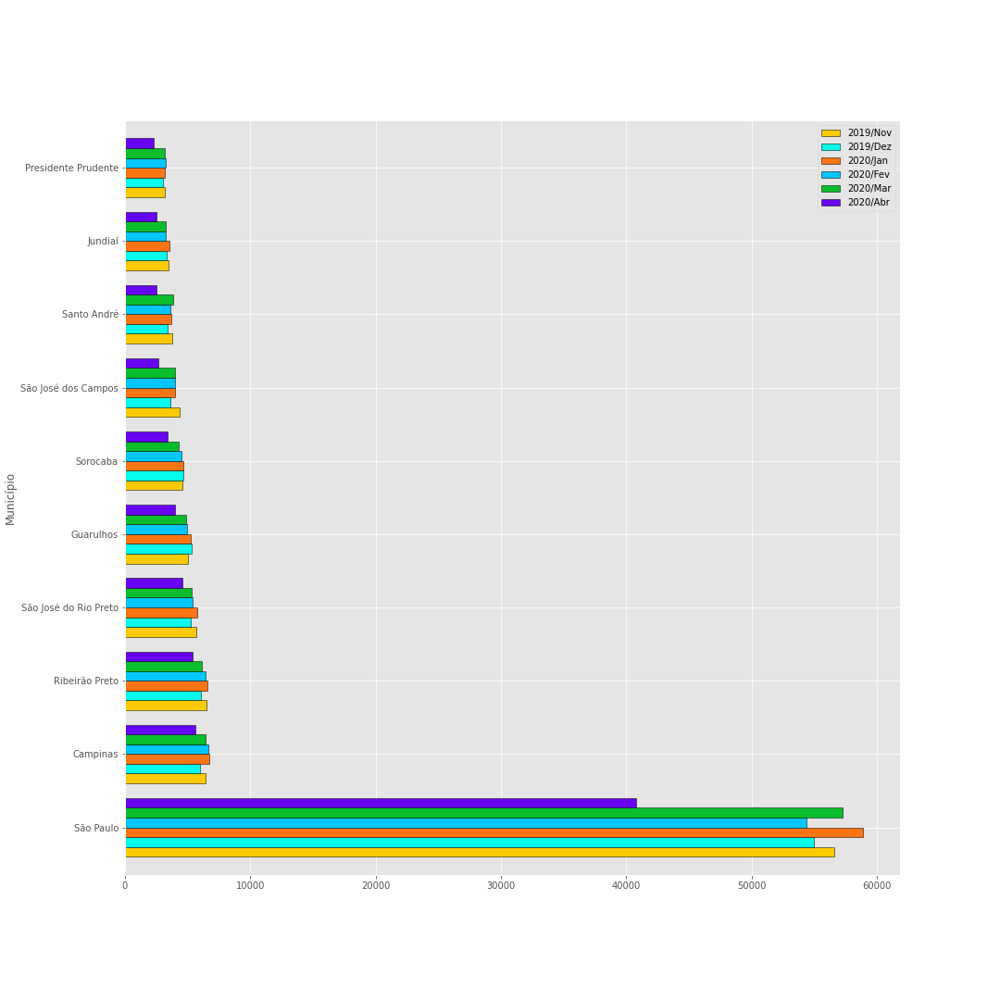

# Análise de Dados de AIH no estado de SP

**Autor: [Eduardo Nunes Cordeiro dos Santos](https://github.com/eduns)**

### Análise da quantidade de registros de Autorizações de Internações Hospitalares (AIH) dos municípios do estado de SP.

    A Autorização de Internação Hospitalar (AIH) é o documento hábil para identificar o paciente e os serviços prestados sob o regime de internação hospitalar e fornecer informações para o gerenciamento do Sistema de Informação Hospitalar. É gerada quando ocorre uma internação em um prestador público ou privado/conveniado ao SUS e é enviada ao gestor da Unidade Prestadora de Serviços.

>Definição: [ANS](http://www.ans.gov.br/aans/index.php?option=com_centraldeatendimento&view=operadora&resposta=1559&historico=22566165)

Nesta análise foram utilizados os 10 municípios com mais registros entre o período
de **Novembro de 2019 a Abril de 2020**

>Origem dos dados: [Datasus Tabnet](http://www2.datasus.gov.br/DATASUS/index.php?area=02)
